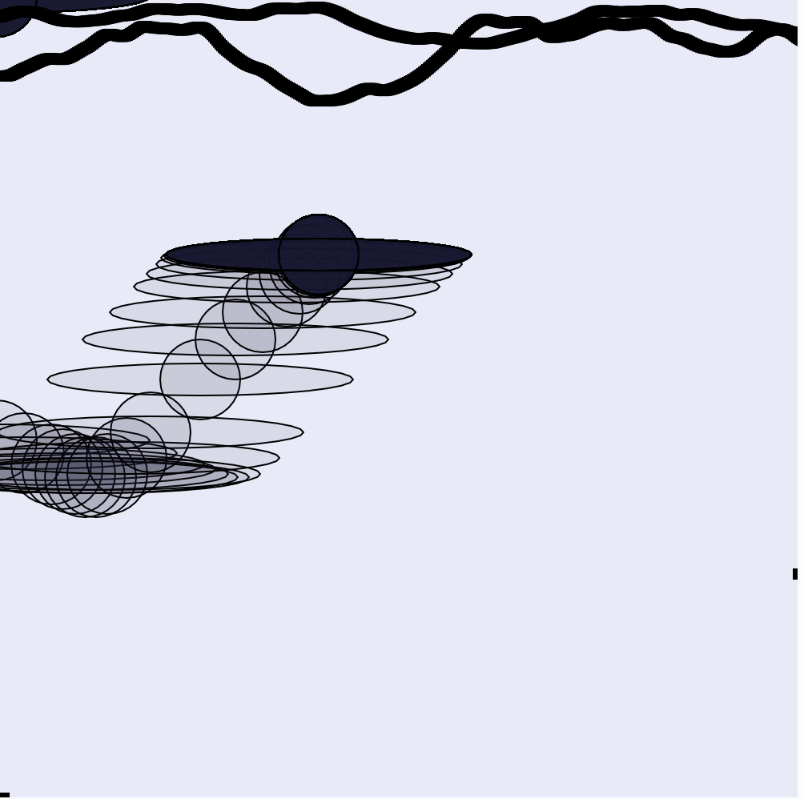

접속 주소 : <https://fforrff.github.io/YJgithub/>

## 진유정
* 과자 먹고 싶다
* **밥** 먹고 싶다
* **집** 가고 싶다
* 빨리 자고 싶다

## 작업
 * [1 UFO](https://editor.p5js.org/fforrff@gmail.com/sketches/fqwsSTuqt)

 

**며칠 전부터 인터넷에서 제주도로 향하는 비행기에서 UFO를 봤다는 사진이 떠돌고 있습니다. 산을 배경으로 UFO가 날아다니는 모습을 그렸습니다.**

 * [2 ThePark](https://editor.p5js.org/fforrff@gmail.com/sketches/9ihb6yZHl)

 

 **수업 시간에 배웠던 코드가 마치 하늘에 구름이 떠다니는 것 같아 구상해 본 하늘입니다.**

 * [3 ShootingStar](https://editor.p5js.org/fforrff@gmail.com/sketches/i4RwdmrIl)

**노을이 질 때의 하늘을 굉장히 좋아하는데, 그 하늘에 떠 있는 별을 본 적은 없지만 달은 본 적이 있습니다. 노을을 배경으로 반짝이는 별을 보고 싶어서 나타내 보았습니다.**

---
